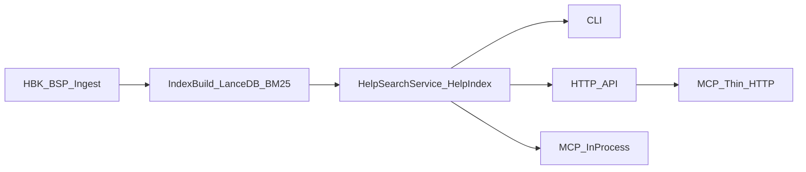

# Архитектура проекта 1c-sntx-sem

## 1. Назначение и контекст

`1c-sntx-sem` - инструмент семантического поиска по справке платформы 1С с тремя способами доступа:

- CLI (`sntx-sem ...`, `python -m sntx_sem ...`)
- HTTP API + Web-UI (`sntx-sem serve`)
- MCP сервер для IDE/агентов (in-process и thin HTTP)

Проект работает с локально собранной базой справки и не хранит ее в git. Основной сценарий:

1. Извлечь данные из HBK/БСП.
2. Построить индекс в LanceDB.
3. Выполнять гибридный поиск (dense + BM25 + RRF) через CLI/API/MCP.

Ключевые внешние зависимости:

- 1С HBK файлы (`hbk/*.hbk`)
- LanceDB/pyarrow (`lancedb`, `pyarrow`)
- Embedding providers: `sentence_transformers`, `openai_compatible`, `ollama`
- FastAPI/uvicorn для HTTP режима
- FastMCP/MCP для интеграции с Cursor/Claude

## 2. Архитектурные принципы

- Один core поиска (`HelpIndex`) используется всеми интерфейсами.
- Ингест и индексация вынесены в общий оркестратор (`indexing.py`) для CLI и API jobs.
- Конфигурация централизована в `config.yaml` -> `AppConfig`.
- Реализованы два режима MCP:
  - in-process: прямой доступ к индексу
  - thin: проксирование в HTTP API
- Состояние индекса и согласованность embedding-модели проверяются через `build_meta.json` и `/status`.

## 3. Компонентная модель

### 3.1 Основные подсистемы

- `src/sntx_sem/hbk/` - извлечение справки из HBK (`extract_hbk`, `ingest_hbk_dir`)
- `src/sntx_sem/bsp/` - извлечение API БСП из XML/BSL (`ingest_bsp`)
- `src/sntx_sem/index/` - ядро индекса и поиска:
  - `store.py` — оркестратор `HelpIndex` (build/load/search);
  - `chunk_text.py` — lexical/semantic текст и метаданные чанков;
  - `storage.py` — LanceDB helpers, domain filters;
  - `ranking.py` — hybrid fusion (dense + BM25 + RRF + бонусы);
  - `explain.py` — explainability результатов;
  - `tokens.py` — токенизация и нормализация запросов;
  - `integrity.py`, `meta.py` — целостность и метаданные индекса.
- `src/sntx_sem/search_service.py` - фасад поиска для CLI/API/MCP
- `src/sntx_sem/api/` - FastAPI endpoints, jobs, UI routes
- `src/sntx_sem/mcp_server.py` - in-process MCP
- `src/sntx_sem/mcp/stdio_server.py` + `mcp/client.py` - thin MCP через HTTP API
- `src/sntx_sem/cli.py` - вход в CLI и команды жизненного цикла данных
- `src/sntx_sem/examples/` - сканирование и поиск примеров из локальных конфигураций

### 3.2 Карта взаимодействий

## 4. Потоки данных

### 4.1 Ingest HBK

Источник: `hbk/*.hbk` -> `hbk/extractor.py`

- `extract_hbk()` парсит TOC/HTML, формирует `HelpChunk`
- домены маппятся как `shlang -> bsl_lang`, `shquery -> query_lang`, `shcntx -> platform_api`
- итоговый merge RU/EN записывается в `data/export/all_chunks.jsonl`

### 4.2 Ingest BSP

Источник: XML выгрузка конфигурации БСП -> `bsp/extractor.py`

- парсинг экспортных методов (`#Область ПрограммныйИнтерфейс`)
- формирование `HelpChunk` с доменом `bsp`
- запись `bsp_api.jsonl` и merge в `all_chunks.jsonl` (замена старого `bsp` домена)

### 4.3 Build index

`indexing.build_index()`:

- загружает `all_chunks.jsonl`
- создает backend эмбеддингов (`embeddings/factory.py`)
- вызывает `HelpIndex.build()`
- записывает метаданные в `data/index/build_meta.json`

`HelpIndex.build()`:

- формирует `semantic_text`, `lexical_text`, `search_text`
- считает embeddings пакетами
- пишет Lance таблицу `help_chunks.lance`
- строит индексы (`vector` IVF опционально + scalar `domain`)
- пишет `chunks_meta.json`

### 4.4 Search runtime

`HelpIndex.search()`:

- lazy load таблицы/метаданных/BM25
- dense search по Lance + BM25 + RRF fusion
- добавляет title bonus и semantic intent bonus
- возвращает `SearchResult` с breakdown и explainability полями

`HelpSearchService`:

- адаптирует результаты к API/MCP формату (`format_search_result`)
- предоставляет `get_topic`, `stats`, `find_examples`

## 5. Интерфейсы системы

### 5.1 CLI

Файл: `src/sntx_sem/cli.py`

Команды жизненного цикла:

- `ingest`, `ingest-bsp`, `index`, `status`
- `serve` (HTTP API)
- `mcp` (автовыбор thin/in-process по `SNTX_SEM_API_URL`)
- `search` (через `HelpSearchService`, тот же путь что API/MCP)
- `scan-examples`

### 5.2 HTTP API

Файлы: `api/app.py`, `api/routes.py`

Ключевые endpoints:

- readiness: `/health`, `/status`, `/stats`, `/logs`
- search: `POST /search`, `GET /topic/{id}`, `POST /examples`
- embedding settings: `GET/PUT /settings/embedding`, `POST /settings/embedding/test`
- jobs: `POST /jobs/*`, `GET /jobs/{id}`
- UI: `/`, `/admin`

### 5.3 MCP

In-process:

- `src/sntx_sem/mcp_server.py`
- использует `HelpSearchService` напрямую

Thin MCP:

- `src/sntx_sem/mcp/stdio_server.py`
- проксирует в API через `SntxSemApiClient`

Оба режима предоставляют одинаковый набор tools (`search_help`, `get_topic`, `find_examples`, ...).

## 6. Конфигурация и окружения

Центр конфигурации: `src/sntx_sem/config.py` + `config.yaml`.

Ключевые секции:

- `embedding` (provider/model/api key/timeouts/prefixes)
- `search` (`dense_top_k`, `bm25_top_k`, `final_top_k`, `rrf_k`, `build_vector_index`)
- `bsp`, `java_exporter`, `mcp`, `api`
- пути данных (`hbk_dir`, `export_dir`, `index_dir`, `data_dir`)

Режимы запуска:

- локальный Python (CLI/API/MCP in-process)
- Docker (`Dockerfile`, `docker-compose.yml`) + thin MCP на хосте

## 7. Нефункциональные требования (фактические)

### 7.1 Производительность

- Warmup индекса/модели при старте API и MCP.
- Пакетная индексация embeddings для снижения пиков RAM.
- `search.build_vector_index` позволяет отключить IVF при нехватке памяти.
- Для Docker рекомендовано 8 GB+ RAM для `domain=all` и IVF rebuild.

### 7.2 Надежность

- Диагностика готовности БД в `bundled_database_status()`:
  - `export_missing`, `index_missing`, `index_broken`, `partial_index`, `embedding_mismatch`, `vector_index_missing`, `bsp_not_indexed`
- Проверка целостности Lance (`index/integrity.py`).
- Healthcheck в Docker и smoke job в CI.

### 7.3 Поддерживаемость

- Единые quality-gates: `ruff`, `mypy`, `pytest`, `pre-commit`.
- Changelog enforcement hook (`scripts/check_changelog.py`) при изменениях `src/sntx_sem/`.
- Версия пакета синхронизируется с `pyproject.toml` (`_version.py`).

### 7.4 Расширяемость

- Фабрика embedding провайдеров (`create_embedding_backend`).
- Отдельные домены данных (`platform_api`, `bsl_lang`, `query_lang`, `bsp`).
- Опциональный контур examples + LLM linking.

## 8. Верификация и качество

Локально и в CI:

- static checks: `ruff`, `mypy`
- tests: `pytest tests/`
- CI workflow: `check` + `docker-smoke`

Ограничения текущей верификации:

- В CI исключен `tests/test_index.py` (тяжелый integration сценарий c HBK).
- Нет coverage gate (`pytest-cov`) и threshold.
- Нет security/static dependency scanning (`pip-audit`, `bandit` и т.д.).

## 9. Архитектурные риски и техдолг

### High

1. ~~Монолитность `HelpIndex` (`index/store.py`, ~1100 строк)~~ — **закрыто в P1** (декомпозиция на `chunk_text`, `storage`, `ranking`, `explain`, `tokens`; `store.py` ~370 строк).

2. Смешение слоев в `config.py`:
   - конфигурация, диагностика БД, проверка целостности индекса, запись настроек
   - усложняет тестирование и ответственность модуля

3. ~~Расхождение путей выполнения CLI vs API/MCP~~ — **закрыто в P1** (CLI `search` через `HelpSearchService`).

4. Дублирование MCP реализаций:
   - in-process и thin имеют параллельные обработчики инструментов и ошибок
   - частично снято contract tests (`tests/test_mcp_contract.py`); полный e2e thin HTTP — в backlog

### Medium

5. In-memory `JobStore`:
   - нет персистентности, нет механизма отмены, jobs теряются при рестарте API

6. API без аутентификации:
   - для локального режима допустимо, но при внешнем доступе требуется security perimeter

7. Частично нестрогая типизация:
   - `mypy strict = false`, широкий `Any` на границах данных

8. Простая реализация `ExamplesStore.search`:
   - substring/overlap без индекса и ранжирования уровня основного search-core

## 10. Приоритетный план улучшений

### P1 (краткосрочно) — выполнено

- ~~Вынести из `HelpIndex` отдельные модули~~
- ~~Унифицировать путь поиска CLI через `HelpSearchService`~~
- ~~Ввести contract tests на паритет MCP in-process vs thin~~

### P2 (среднесрочно)

- Разделить `config.py` на:
  - loader/validation
  - settings persistence
  - database diagnostics
- Добавить coverage отчет и минимальный threshold в CI.
- Вернуть интеграционный индексный тест в CI (или отдельный nightly job).

### P3 (долгосрочно)

- Ввести ADR каталог (`docs/adr/`) для фиксации архитектурных решений.
- Добавить security job (dependency scan + static security checks).
- Рассмотреть персистентный backend для jobs (при расширении server-mode).

## 11. Границы и ограничения

- Проект зависит от локальной лицензированной базы 1С; артефакты `data/` и `hbk/` не публикуются.
- Для больших индексов и `domain=all` критична доступная RAM в Docker.
- Текущее архитектурное состояние ориентировано на локальный self-hosted режим, не на multi-tenant deployment.

