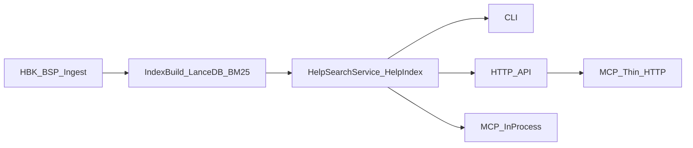

# Архитектура 1c-sntx-sem (кратко)

Полная версия аудита: [`architect.md`](../architect.md).

## Назначение

Проект предоставляет семантический поиск по справке 1С и API БСП через три интерфейса:

- CLI (`sntx-sem`, `python -m sntx_sem`)
- HTTP API + Web-UI (`sntx-sem serve`)
- MCP (in-process и thin HTTP)

## Компоненты

- `hbk/` и `bsp/` - ingest источников в унифицированные чанки.
- `index/` - построение и хранение индекса:
  - `store.py` — `HelpIndex` (оркестратор);
  - `chunk_text.py`, `storage.py` — текст чанков и LanceDB helpers;
  - `ranking.py` — hybrid fusion; `explain.py` — explainability;
  - `tokens.py` — токенизация; `integrity.py`, `meta.py` — метаданные.
- `search_service.py` - единый фасад поиска для CLI/API/MCP.
- `api/` - REST endpoints, jobs, admin UI.
- `mcp_server.py` и `mcp/stdio_server.py` - два режима MCP.
- `cli.py` - команды жизненного цикла (`ingest`, `index`, `search`, `serve`, `mcp`).

## Основной поток данных

## Режимы MCP

- **In-process**: `python -m sntx_sem.mcp_server`  
  Прямой доступ к `HelpSearchService` и индексу.
- **Thin**: `sntx-sem mcp` + `SNTX_SEM_API_URL`  
  MCP tools проксируются в HTTP API (`/search`, `/topic`, `/examples`, `/stats`).

## Поиск и ранжирование

`HelpIndex.search()` использует гибридный pipeline:

- dense vector search по LanceDB;
- BM25 по лексическому представлению;
- RRF fusion;
- пост-бонусы (`title_bonus`, `semantic_intent_bonus`);
- explainability поля (`match_sources`, `score_breakdown`, `match_explanation`).

## Конфигурация и окружение

Единая конфигурация в `config.yaml` (`AppConfig`):

- `embedding` - провайдер, модель, API key, timeout;
- `search` - top-k, `rrf_k`, `build_vector_index`;
- `api`, `mcp`, `bsp`, `java_exporter`, пути данных.

Deployment:

- локально (Python);
- Docker (`docker-compose.yml`) + thin MCP на хосте.

## Качество и надежность

- Checks: `ruff`, `mypy`, `pytest`, pre-commit hooks.
- CI: линтеры/типизация/тесты + `docker-smoke`.
- Диагностика БД: `/status`, `/health`, `bundled_database_status()`.

## Основные риски

- ~~Высокая связность `HelpIndex` (`index/store.py`)~~ — снято в P1 (модульная декомпозиция).
- Смешение ответственности в `config.py`.
- Потенциальный drift между in-process и thin MCP (частично покрыт `tests/test_mcp_contract.py`).
- Нет coverage/security gate в CI.

## ADR

Ключевые решения вынесены в [`docs/adr/README.md`](adr/README.md).

## Improvement Plan

Отдельный roadmap улучшений: [`docs/IMPROVEMENT_PLAN.md`](IMPROVEMENT_PLAN.md).

## Architecture Governance Agent

Для надзора соответствия реализации архитектуре используйте sub-agent:

- [`.cursor/agents/architect.md`](../.cursor/agents/architect.md)

Он выполняет readonly review плана и изменений с фокусом на scalability, modularity, maintainability и контролем архитектурного drift.
